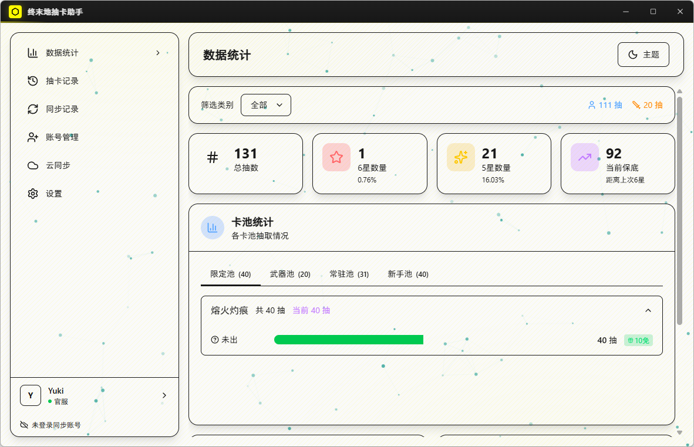
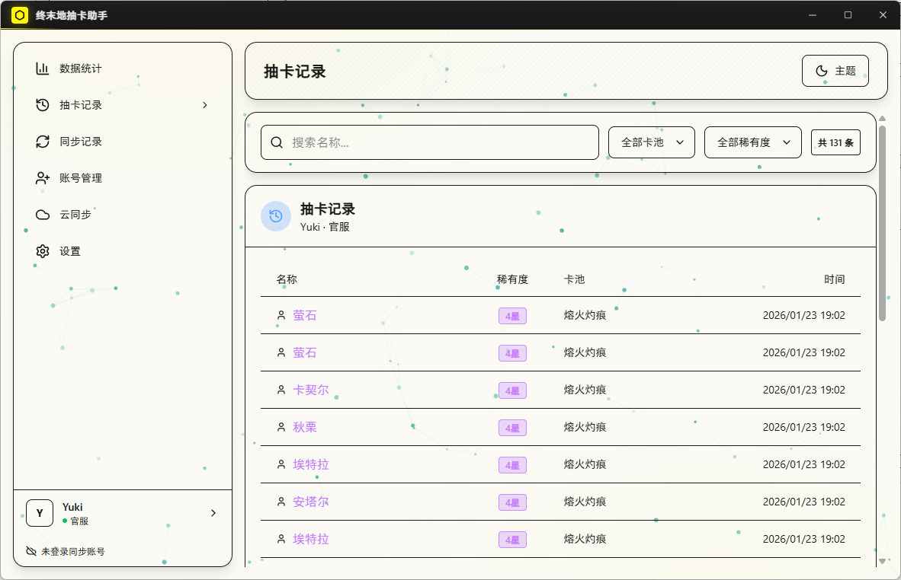
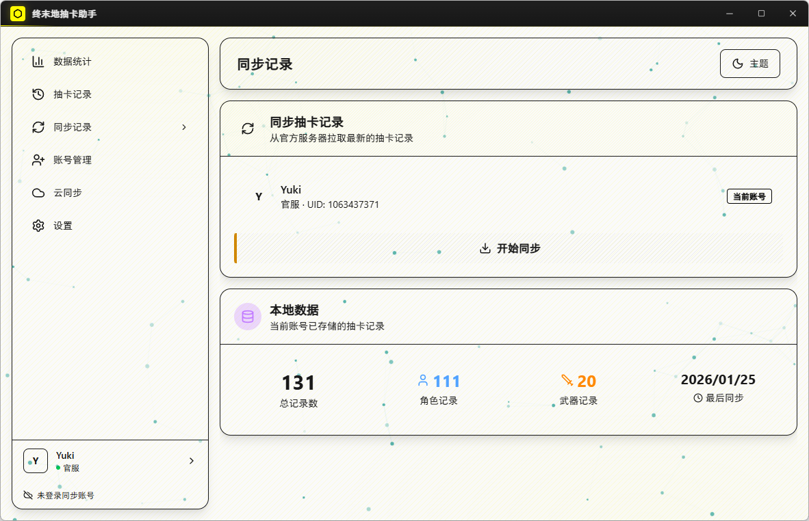
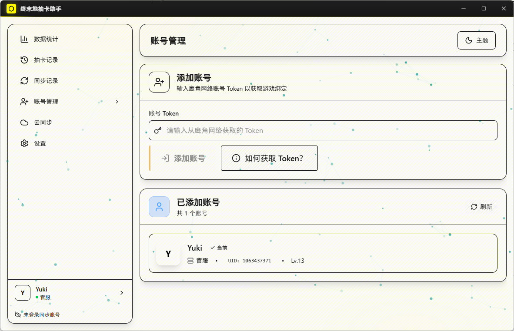
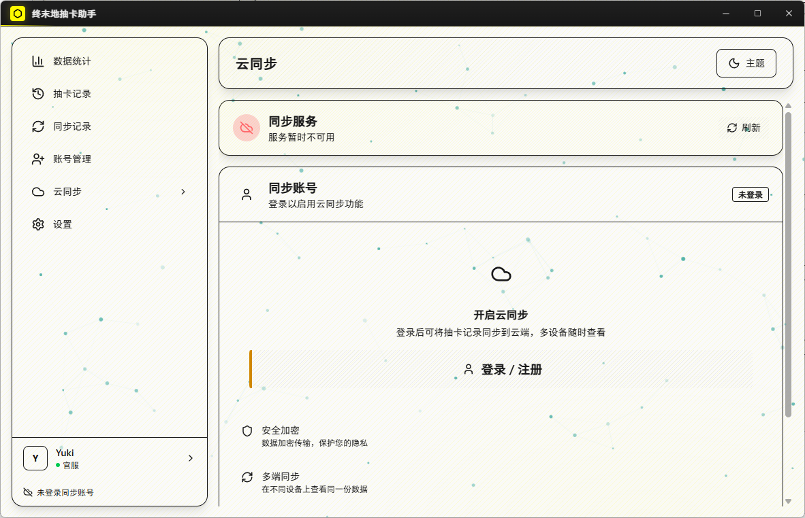
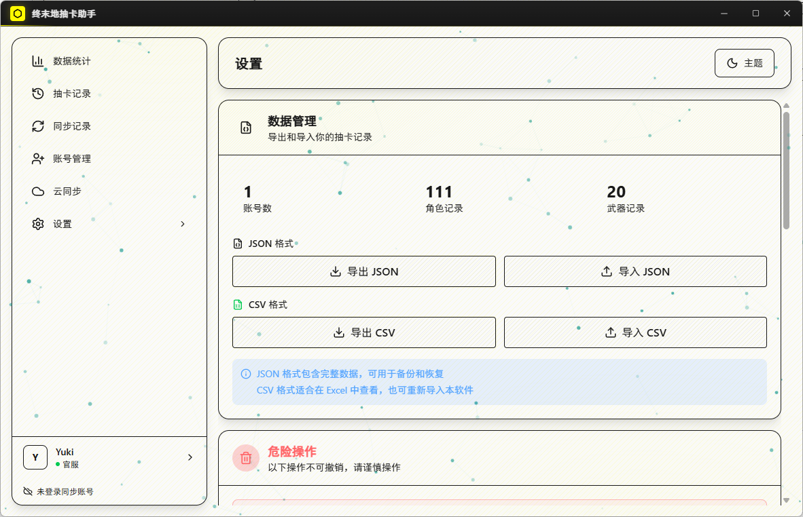

# 终末地抽卡助手

<p align="center">
  
</p>

<p align="center">
  一款用于管理《终末地》抽卡记录的桌面工具
</p>

<p align="center">
  <a href="https://github.com/xccccya/EndfieldGachaHelper/releases">
    
  </a>
  <a href="LICENSE">
    
  </a>
</p>

## 功能

- 抽卡记录同步与查询
- 抽卡数据统计分析
- 保底进度追踪
- 多账号管理
- 云端数据同步
- 中英双语支持

## 预览

<p align="center">
  
  
</p>
<p align="center">
  
  
</p>
<p align="center">
  
  
</p>

## 技术栈

| 模块 | 技术 |
|------|------|
| 桌面端 | Tauri v2 + React + Vite + TailwindCSS |
| 后端 API | NestJS + Fastify + Prisma |
| 数据库 | MySQL |

## 快速开始

### 环境要求

- Node.js（建议 LTS）
- Rust 工具链（用于 Tauri 构建）
- MySQL 8.x（云同步功能）

### 安装依赖

```bash
npm install
```

### 启动开发

```bash
# 启动桌面端
npm run dev:desktop

# 启动后端 API（可选，云同步功能需要）
npm run dev:api
```

### 构建

```bash
# 构建 Tauri 桌面应用
npm run tauri:build -w @efgachahelper/desktop
```

## 目录结构

```
├── apps/
│   ├── desktop/     # Tauri 桌面端
│   └── api/         # NestJS 后端 API
├── packages/
│   └── shared/      # 共享类型定义
└── infra/           # 基础设施脚本
```

## 许可证

[Apache License 2.0](LICENSE)
